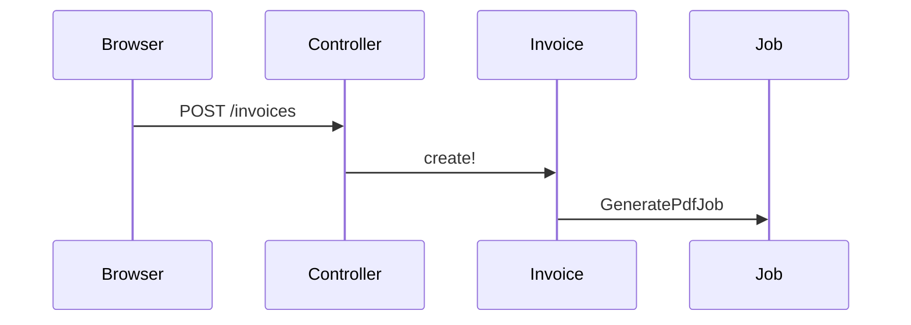

Help the user understand the current topic visually. Skip the preamble and keep prose brief. Pick the *smallest view* that makes the *shape* clear.

- Show logic, a callback chain, or an algorithm as pseudocode:

```text
on(create)
  persist invoice
  enqueue GeneratePdfJob
  deliver receipt
```

- Show runtime control flow as a call tree. Show associations as an object tree:

```text
InvoicesController#create
  InvoicePolicy#create?
  Invoice.create!
    after_create → InvoiceMailer.receipt
    after_commit → GeneratePdfJob
```

```text
Account
  invoices
    line_items
    customer
```

- Show UI structure as a view tree: templates, partials, components, Turbo frames, and Stimulus controllers that matter:

```text
invoices/show
  turbo_frame :invoice
    _status_badge
    _line_items
      _line
  invoice_controller.js    # mark paid
```

- Show file responsibility or a broad refactor as a shallow file tree:

```text
app/
├── controllers/invoices_controller.rb  # HTTP + policy entry
├── models/invoice.rb                   # invariants, state
├── jobs/generate_pdf_job.rb            # async PDF
└── mailers/invoice_mailer.rb           # receipt email
```

- Show object interaction, request flow, or job/mailer/Turbo flow with Mermaid:



- Use `diff` when the point is what changes and the surrounding shape already exists. Match the diff shape to the topic.

For a view change:

```diff
 invoices/show
   turbo_frame :invoice
     _status_badge
+    _payment_form
     _line_items
```

For a file-layout change:

```diff
 app/
  ├── controllers/invoices_controller.rb
  ├── models/invoice.rb
+ ├── jobs/generate_pdf_job.rb
  └── mailers/invoice_mailer.rb
```

For a call-tree change:

```diff
 InvoicesController#create
   InvoicePolicy#create?
   Invoice.create!
-    after_create → InvoiceMailer.receipt
-    after_commit → GeneratePdfJob
+  CreateInvoice.call
+    Invoice.create!
+    InvoiceMailer.receipt.deliver_later
+    GeneratePdfJob.perform_later
```

For a state or control-flow change:

```diff
 on(create)
-  persist invoice
-  deliver receipt
+  persist invoice
+  enqueue GeneratePdfJob
+  deliver receipt
```

- Show the whole block when most of it is new, when omitted context would hide ownership or order, or when the user needs a copyable target shape:

```ruby
class Invoice < ApplicationRecord
  def mark_paid!(by:)
    update!(paid_at: Time.current, paid_by: by)
  end
end
```

- For a visual UI, layout, state comparison, or concept too dense for Mermaid, write one focused HTML file — a diagram, an infographic, or a short slide deck, whichever fits the point. Match the app's UI if it has one; use real labels and data; support desktop and mobile. Write `show-me-<slug>.html` next to the work, then open it with `xdg-open`.

## Guidance

Place each visual next to the short text it supports. Keep only the calls, files, templates, states, and boundaries needed to answer the current question.

One or several views; not all of them.

This skill presents *shape*.

Adapted from HumanLayer `show-me` (MIT).
